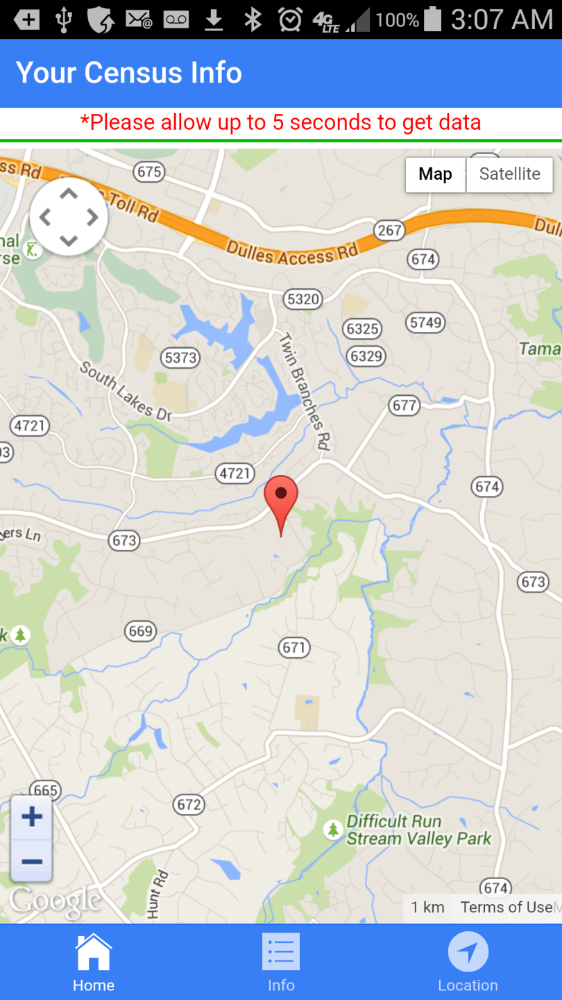
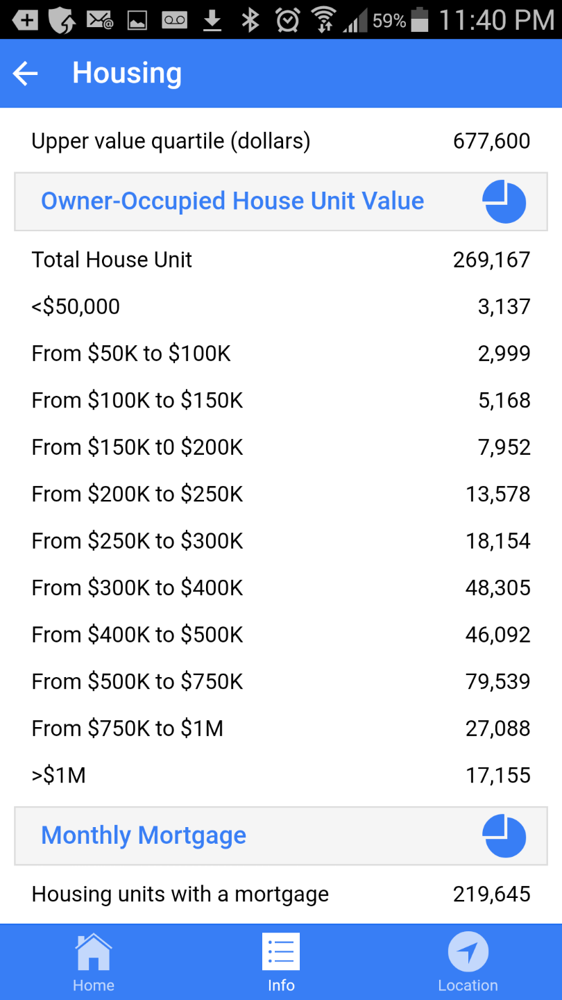
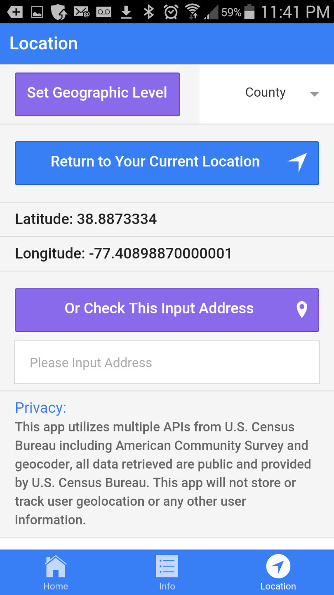

# CensusInfo

Have you ever think about to explore your neighbour such as household income, house value, rent paid every month, or even how many minutes spend on commute?

This product provide a quick and simple way to retrieve those information on interactive map. You could drag around the marker or input any address, double click the marker will retrieve related information. You also could filter on nationwide, state, county and tract level. It uses multiple Census Bureau API providing the following information:

<ul>
<li>1) Sex, Age, Race and Birth Place</li>
<li>2) Employment Status, Commute Time, Occupation</li>
<li>3) House Type, Year Built, House Value, Monthly Mortgage Payment, Monthly Rent</li>
<li>4) Household Income, Income Per Capita, Poverty by Race</li>
<li>5)Educational Attainment, School Enrolment</li>
</ul>

  
  
 

The www folder is the core component of Cordova project. After you create the Cordova project, you may replace the www folder with this one.

The www folder strcture:
<pre>
  index.html --the start page
  css folder -- style sheet
  lib folder for ionic css & js
	ionic   (include both regular and min)
		css
		font
		js    (ionic.bundle.js include core angular.js)</td><tr>
  scripts (inside index.js you need to provide your own Google Developer Key for Google Map JavaScript API)
    controllers
    frameworks (additional directive beyond ionic or angularjs)
    services
</pre>

