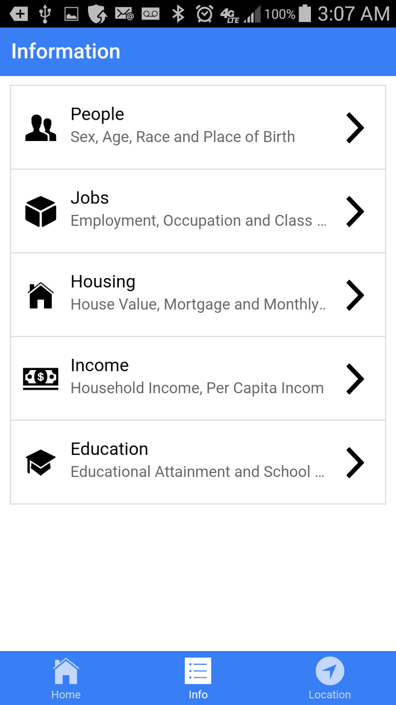

# CensusInfo
Mobile Apps to explore census public information on interactive map available on Android and iOS
You may check censusinfo.html first, there have a brief information about the application and install links for Google Play Store and Apple iTune Store.

The www folder is the core component of Cordova project. After you create the Cordova project, you may replace the www folder with this one.

The www folder strcture:

  index.html --the start page
  css folder -- style sheet
  lib folder for ionic css & js
      ionic   (include both regular and min)
          css
          font
          js    (ionic.bundle.js include core angular.js)
  scripts (inside index.js you need to provide your own Google Developer Key for Google Map JavaScript API)
    controllers
    frameworks (additional directive beyond ionic or angularjs)
    services

<h2>For Census Info</h2>

This is Zhong's project based on U.S. Census Bureau Geocoder API, the project is created with AngularJS, GoogleMap JavaScript API and Cordova. Cordova is a framework hat targets multiple mobile platforms: Android, iOS, Windows, and Windows Phone. 

You may double click the marker in the map to retrieve census and other public information provided by U.S. Census Bureau Geocoder API, also you could drag around the marker (the initial location is your phone location) and explore nearby area.

For question or support, please reach me at zfang AT gmail.com

